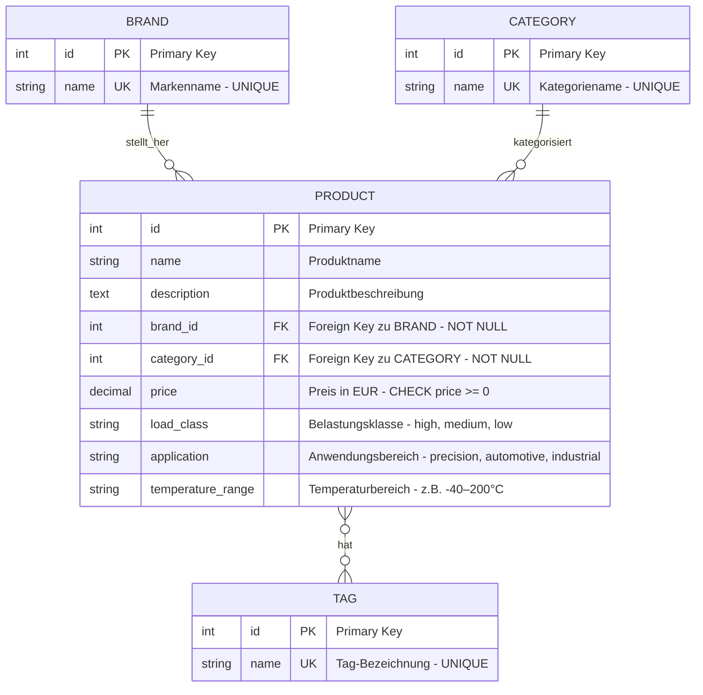

# ER-Diagramm: Produktdatenbank

## Übersicht der Entitäten und Beziehungen



## Dateiübersicht

Die Datenbank besteht aus **4 CSV-Dateien**:

1. **brand.csv** - Markenstammdaten (5 Einträge)
2. **category.csv** - Kategoriestammdaten (4 Einträge)
3. **tag.csv** - Tag-Stammdaten (5 Einträge)
4. **product.csv** - Produktdaten mit allen Attributen (1000 Einträge)

## Beziehungsbeschreibungen

### 1:N Beziehungen (One-to-Many)

- **BRAND → PRODUCT**: Eine Marke kann mehrere Produkte herstellen (1:N)
  - Jedes Produkt muss genau einer Marke zugeordnet sein (NOT NULL Constraint)
  
- **CATEGORY → PRODUCT**: Eine Kategorie kann mehrere Produkte enthalten (1:N)
  - Jedes Produkt muss genau einer Kategorie zugeordnet sein (NOT NULL Constraint)

### M:N Beziehung (Many-to-Many)

- **PRODUCT ↔ TAG**: Ein Produkt kann mehrere Tags haben und ein Tag kann mehreren Produkten zugeordnet sein (M:N)
  - Die M:N-Beziehung wird direkt durch die Datenbank-Implementierung (z.B. Junction-Table) realisiert
  - Ein Produkt kann 0 bis mehrere Tags haben
  - Ein Tag kann 0 bis mehreren Produkten zugeordnet sein

## Detaillierte Entitätsbeschreibungen

### BRAND (brand.csv)
**Datensätze:** 5  
**Inhalt:** Lagerhersteller

| Attribut | Typ | Constraints | Beschreibung |
|----------|-----|-------------|--------------|
| id | INTEGER | PRIMARY KEY | Eindeutige Marken-ID |
| name | VARCHAR(100) | UNIQUE, NOT NULL | Markenname |

**Beispieldaten:**

| ID | Name |
|----|------|
| 1 | SKF |
| 2 | FAG |
| 3 | Schaeffler |
| 4 | INA |
| 5 | NSK |

### CATEGORY (category.csv)
**Datensätze:** 4  
**Inhalt:** Produktkategorien

| Attribut | Typ | Constraints | Beschreibung |
|----------|-----|-------------|--------------|
| id | INTEGER | PRIMARY KEY | Eindeutige Kategorie-ID |
| name | VARCHAR(100) | UNIQUE, NOT NULL | Kategoriename |

**Beispieldaten:**

| ID | Name |
|----|------|
| 1 | Wälzlager |
| 2 | Dichtungen |
| 3 | Kugellager |
| 4 | Rollenlager |

### TAG (tag.csv)
**Datensätze:** 5  
**Inhalt:** Beschreibende Schlagwörter

| Attribut | Typ | Constraints | Beschreibung |
|----------|-----|-------------|--------------|
| id | INTEGER | PRIMARY KEY | Eindeutige Tag-ID |
| name | VARCHAR(100) | UNIQUE, NOT NULL | Tag-Bezeichnung |

**Beispieldaten:**

| ID | Name |
|----|------|
| 1 | Industrie |
| 2 | Automotive |
| 3 | Premium |
| 4 | Heavy Duty |
| 5 | OEM |

### PRODUCT (product.csv)
**Datensätze:** 1000  
**Inhalt:** Alle Produkte mit vollständigen Attributen

| Attribut | Typ | Constraints | Beschreibung |
|----------|-----|-------------|--------------|
| id | INTEGER | PRIMARY KEY | Eindeutige Produkt-ID |
| name | VARCHAR(255) | NOT NULL | Produktbezeichnung |
| description | TEXT | | Detaillierte Produktbeschreibung |
| brand_id | INTEGER | FOREIGN KEY → brand(id), NOT NULL | Referenz zur Marke |
| category_id | INTEGER | FOREIGN KEY → category(id), NOT NULL | Referenz zur Kategorie |
| price | DECIMAL(10,2) | NOT NULL, CHECK (price >= 0) | Preis in EUR |
| load_class | VARCHAR(50) | | Belastungsklasse: high, medium, low |
| application | VARCHAR(50) | | Anwendungsbereich: precision, automotive, industrial |
| temperature_range | VARCHAR(50) | | Betriebstemperatur (z.B. -40–200°C) |

**Beispieldaten:**
- IDs: 1-1000
- Produktnamen: z.B. "SKF WIE-5012", "FAG ROL-3456 (Variante B)"
- Preise: 50.00 - 450.00 EUR
- Alle Produkte haben technische Spezifikationen (load_class, application, temperature_range)

## Datenmengen

| Tabelle | Datensätze | Datei |
|---------|-----------|-------|
| BRAND | 5 | brand.csv |
| CATEGORY | 4 | category.csv |
| TAG | 5 | tag.csv |
| PRODUCT | 1000 | product.csv |
| **Gesamt** | **1.014** | **4 Dateien** |

## Kardinalitäten Legende

- `||--o{` = Eins zu Viele (1:N)
  - Genau ein Datensatz auf der linken Seite
  - Null bis viele Datensätze auf der rechten Seite
- `}o--o{` = Viele zu Viele (M:N)
  - Null bis viele Datensätze auf beiden Seiten
  
**Beispiele:**
- Ein BRAND hat viele PRODUCTs
- Eine CATEGORY hat viele PRODUCTs
- Ein PRODUCT gehört zu genau einem BRAND (NOT NULL)
- Ein PRODUCT gehört zu genau einer CATEGORY (NOT NULL)
- Ein PRODUCT kann mehrere TAGs haben (M:N)
- Ein TAG kann mehreren PRODUCTs zugeordnet sein (M:N)

## Datenbankdesign-Hinweise

### Normalisierung (3NF erreicht)

Das Schema erfüllt die **3. Normalform (3NF)**:

**1. Normalform (1NF):**
- ✓ Alle Attribute sind atomar (keine Listen oder Arrays)
- ✓ Jede Zelle enthält nur einen Wert
- ✓ Jede Zeile ist eindeutig identifizierbar durch Primary Key

**2. Normalform (2NF):**
- ✓ 1NF ist erfüllt
- ✓ Alle Nicht-Schlüssel-Attribute sind voll funktional abhängig vom Primary Key
- ✓ Keine partiellen Abhängigkeiten (alle PKs sind einzelne Attribute)

**3. Normalform (3NF):**
- ✓ 2NF ist erfüllt
- ✓ Keine transitiven Abhängigkeiten
- ✓ Stammdaten (BRAND, CATEGORY, TAG) sind in separate Tabellen ausgelagert
- ✓ Keine redundanten Daten - Marken- und Kategorienamen werden nur einmal gespeichert

### Referenzielle Integrität

Alle Foreign Keys sind korrekt definiert und gewährleisten Datenintegrität:

| Foreign Key | Referenziert | Constraint |
|-------------|--------------|------------|
| product.brand_id | brand.id | NOT NULL, ON DELETE RESTRICT |
| product.category_id | category.id | NOT NULL, ON DELETE RESTRICT |

**Integritätsregeln:**
- Ein Produkt muss immer eine gültige Marke haben (NOT NULL)
- Ein Produkt muss immer eine gültige Kategorie haben (NOT NULL)
- Marken und Kategorien können nicht gelöscht werden, wenn noch Produkte darauf verweisen (RESTRICT)
- Die M:N-Beziehung zwischen PRODUCT und TAG wird durch eine Junction-Tabelle realisiert

### Constraints und Datenintegrität

**Primary Keys:**
- Jede Tabelle hat einen eindeutigen PRIMARY KEY (id)
- Auto-Increment für neue Datensätze

**Unique Constraints:**
- brand.name: UNIQUE (keine doppelten Markennamen)
- category.name: UNIQUE (keine doppelten Kategorienamen)
- tag.name: UNIQUE (keine doppelten Tag-Namen)

**NOT NULL Constraints:**
- Alle Primary Keys
- brand.name, category.name, tag.name
- product.name, product.brand_id, product.category_id, product.price

**Check Constraints:**
- product.price >= 0 (keine negativen Preise)

**Optionale Felder:**
- product.description (kann NULL sein)
- product.load_class (kann NULL sein)
- product.application (kann NULL sein)
- product.temperature_range (kann NULL sein)

### Datentypen

| Attribut | Datentyp | Begründung |
|----------|----------|------------|
| id (alle Tabellen) | INTEGER | Effizient für Primary Keys |
| name (BRAND, CATEGORY, TAG) | VARCHAR(100) | Feste maximale Länge für Namen |
| product.name | VARCHAR(255) | Längere Produktbezeichnungen möglich |
| product.description | TEXT | Unbegrenzte Textlänge für Beschreibungen |
| product.price | DECIMAL(10,2) | Präzise Währungsangaben (bis 99.999.999,99) |
| product.load_class | VARCHAR(50) | Enum-ähnliche Werte |
| product.application | VARCHAR(50) | Enum-ähnliche Werte |
| product.temperature_range | VARCHAR(50) | Flexible Temperaturangaben |

### Indexierung (Empfohlen)

Für optimale Performance sollten folgende Indizes erstellt werden:

```sql
-- Primary Keys (automatisch indiziert)
-- BRAND(id), CATEGORY(id), TAG(id), PRODUCT(id)

-- Foreign Keys (für JOIN-Performance)
CREATE INDEX idx_product_brand ON product(brand_id);
CREATE INDEX idx_product_category ON product(category_id);

-- Unique Constraints (automatisch indiziert)
-- BRAND(name), CATEGORY(name), TAG(name)

-- Suchfelder
CREATE INDEX idx_product_name ON product(name);
CREATE INDEX idx_product_price ON product(price);
```

### Skalierbarkeit

Das Design ist skalierbar und erweiterbar:
- ✓ Neue Marken, Kategorien und Tags können einfach hinzugefügt werden
- ✓ Unbegrenzte Anzahl von Produkten möglich
- ✓ M:N-Beziehung zwischen PRODUCT und TAG erlaubt flexible Verschlagwortung
- ✓ Zusätzliche technische Attribute in PRODUCT-Tabelle sind optional (NULL erlaubt)
- ✓ Schema kann leicht um weitere Attribute erweitert werden
