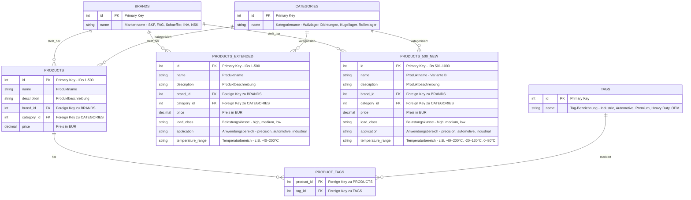

# ER-Diagramm: Produktdatenbank

## Übersicht der Entitäten und Beziehungen

## Dateiübersicht

Die Datenbank besteht aus **7 CSV-Dateien**:

### Stammdaten (Master Data)
1. **brands.csv** - 5 Marken (SKF, FAG, Schaeffler, INA, NSK)
2. **categories.csv** - 4 Kategorien (Wälzlager, Dichtungen, Kugellager, Rollenlager)
3. **tags.csv** - 5 Tags (Industrie, Automotive, Premium, Heavy Duty, OEM)

### Produktdaten (Product Data)
4. **products.csv** - 500 Basis-Produkte (IDs 1-500) mit 6 Attributen
5. **products_extended.csv** - 500 erweiterte Produkte (IDs 1-500) mit 9 Attributen
6. **products_500_new.csv** - 500 neue Produkte (IDs 501-1000) mit 9 Attributen

### Verknüpfungstabelle (Junction Table)
7. **product_tags.csv** - M:N Zuordnung zwischen Produkten und Tags

## Beziehungsbeschreibungen

### 1:N Beziehungen (One-to-Many)

- **BRANDS → PRODUCTS**: Eine Marke kann mehrere Produkte herstellen (1:N)
- **BRANDS → PRODUCTS_EXTENDED**: Eine Marke kann mehrere erweiterte Produkte herstellen (1:N)
- **BRANDS → PRODUCTS_500_NEW**: Eine Marke kann mehrere neue Produkte herstellen (1:N)
- **CATEGORIES → PRODUCTS**: Eine Kategorie kann mehrere Produkte enthalten (1:N)
- **CATEGORIES → PRODUCTS_EXTENDED**: Eine Kategorie kann mehrere erweiterte Produkte enthalten (1:N)
- **CATEGORIES → PRODUCTS_500_NEW**: Eine Kategorie kann mehrere neue Produkte enthalten (1:N)

### M:N Beziehung (Many-to-Many)

- **PRODUCTS ↔ TAGS**: Ein Produkt kann mehrere Tags haben und ein Tag kann mehreren Produkten zugeordnet sein (M:N)
  - Realisiert durch die Zwischentabelle **PRODUCT_TAGS**
  - Basiert auf den Daten aus **products.csv** (IDs 1-500)

## Detaillierte Entitätsbeschreibungen

### BRANDS (brands.csv)
**Datensätze:** 5  
**Inhalt:** Lagerhersteller

| ID | Name |
|----|------|
| 1 | SKF |
| 2 | FAG |
| 3 | Schaeffler |
| 4 | INA |
| 5 | NSK |

### CATEGORIES (categories.csv)
**Datensätze:** 4  
**Inhalt:** Produktkategorien

| ID | Name |
|----|------|
| 1 | Wälzlager |
| 2 | Dichtungen |
| 3 | Kugellager |
| 4 | Rollenlager |

### TAGS (tags.csv)
**Datensätze:** 5  
**Inhalt:** Beschreibende Schlagwörter

| ID | Name |
|----|------|
| 1 | Industrie |
| 2 | Automotive |
| 3 | Premium |
| 4 | Heavy Duty |
| 5 | OEM |

### PRODUCTS (products.csv)
**Datensätze:** 500 (IDs 1-500)  
**Attribute:** 6  
**Besonderheit:** Basis-Produkttabelle ohne erweiterte technische Attribute

**Attribute:**
- `id` - Eindeutige Produkt-ID
- `name` - Produktbezeichnung (z.B. "SKF WIE-5012")
- `description` - Detaillierte Produktbeschreibung
- `brand_id` - Referenz zur Marke (1-5)
- `category_id` - Referenz zur Kategorie (1-4)
- `price` - Preis in EUR (50.00 - 450.00)

### PRODUCTS_EXTENDED (products_extended.csv)
**Datensätze:** 500 (IDs 1-500)  
**Attribute:** 9  
**Besonderheit:** Erweiterte Version von products.csv mit zusätzlichen technischen Spezifikationen

**Zusätzliche Attribute:**
- `load_class` - Belastungsklasse: high, medium, low
- `application` - Anwendungsbereich: precision, automotive, industrial
- `temperature_range` - Betriebstemperatur: -40–200°C, -20–120°C, 0–80°C

### PRODUCTS_500_NEW (products_500_new.csv)
**Datensätze:** 500 (IDs 501-1000)  
**Attribute:** 9  
**Besonderheit:** Neue Produktvarianten (Variante B) mit vollständigen technischen Spezifikationen

**Merkmale:**
- IDs beginnen bei 501
- Produktnamen haben Suffix "(Variante B)"
- Gleiche Attributstruktur wie products_extended.csv
- Erweiterte Temperaturbereiche und Belastungsklassen

### PRODUCT_TAGS (product_tags.csv)
**Datensätze:** 995 Zuordnungen  
**Besonderheit:** N:M-Beziehung zwischen Produkten und Tags

**Attribute:**
- `product_id` - Referenz zu PRODUCTS (1-500)
- `tag_id` - Referenz zu TAGS (1-5)

**Statistik:**
- Durchschnittlich ~2 Tags pro Produkt
- Ein Produkt kann 1-5 Tags haben
- Jeder Tag ist mehreren Produkten zugeordnet

## Datenmengen

| Tabelle | Datensätze | Datei |
|---------|-----------|-------|
| BRANDS | 5 | brands.csv |
| CATEGORIES | 4 | categories.csv |
| TAGS | 5 | tags.csv |
| PRODUCTS | 500 | products.csv |
| PRODUCTS_EXTENDED | 500 | products_extended.csv |
| PRODUCTS_500_NEW | 500 | products_500_new.csv |
| PRODUCT_TAGS | ~995 | product_tags.csv |
| **Gesamt** | **~2.509** | **7 Dateien** |

## Kardinalitäten Legende

- `||--o{` = Eins zu Viele (1:N)
  - Genau ein Datensatz auf der linken Seite
  - Null bis viele Datensätze auf der rechten Seite
- Ein Brand hat viele Products
- Eine Category hat viele Products
- Ein Product kann viele Tags haben (über PRODUCT_TAGS)
- Ein Tag kann vielen Products zugeordnet sein (über PRODUCT_TAGS)

## Datenbankdesign-Hinweise

### Normalisierung
- **3. Normalform (3NF)** erreicht
- Keine redundanten Daten in Stammdatentabellen
- Transitive Abhängigkeiten eliminiert

### Referentielle Integrität
- Alle Foreign Keys verweisen auf gültige Primary Keys
- `brand_id` → `brands.id`
- `category_id` → `categories.id`
- `product_id` → `products.id`
- `tag_id` → `tags.id`

### Datentypen
- **ID-Felder:** INTEGER (Primary Keys)
- **Name/Description:** VARCHAR/TEXT
- **Price:** DECIMAL(10,2)
- **Enumerations:** VARCHAR (load_class, application, temperature_range)
