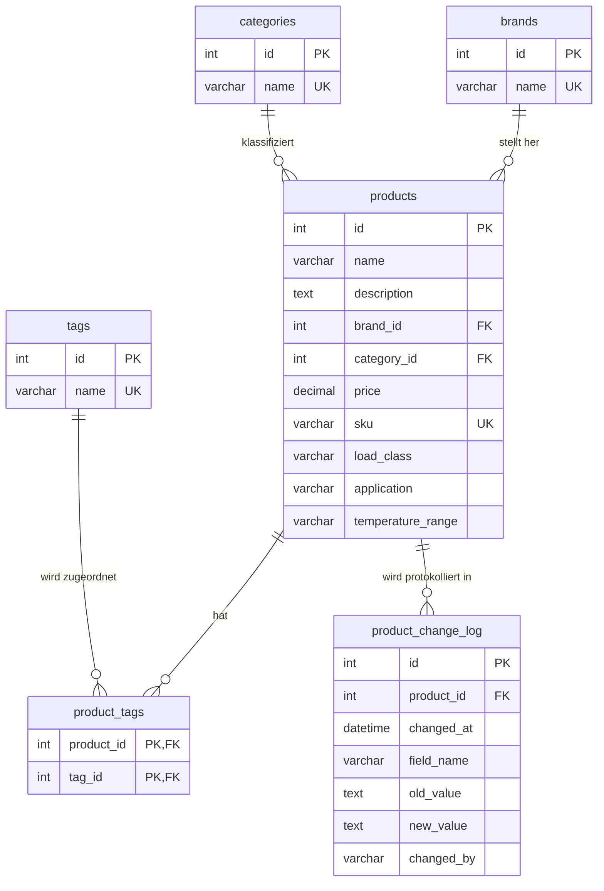

# ER-Diagramm: Produktdatenbank

## Zweck

Dieses Dokument beschreibt das relationale Kernmodell der Abgabe. Es orientiert sich an der finalen DDL in `schema.sql` und verwendet dieselben Tabellennamen wie die laufende Anwendung und die Docker-Initialisierung.

---

## Kernmodell als Mermaid-ER-Diagramm

---

## Tabellenuebersicht

### Kernentitaeten

| Tabelle | Rolle | Wichtige Attribute |
|---------|-------|--------------------|
| `brands` | Herstellerstamm | `id`, `name` |
| `categories` | Produktkategorien | `id`, `name` |
| `tags` | Schlagwoerter fuer Kontext und Suche | `id`, `name` |
| `products` | zentrales Produktobjekt | `id`, `name`, `description`, `brand_id`, `category_id`, `price`, `sku`, `load_class`, `application`, `temperature_range` |
| `product_tags` | M:N-Junction zwischen Produkten und Tags | `product_id`, `tag_id` |

### Operative Zusatztabellen

| Tabelle | Zweck |
|---------|-------|
| `product_change_log` | wird vom MySQL-Trigger fuer A3 automatisch befuellt |
| `etl_run_log` | protokolliert Index-Builds fuer Qdrant |

`etl_run_log` gehoert nicht zum fachlichen Kern-ER-Modell der Produktdaten, ist aber Teil des gelieferten relationalen Schemas.

---

## Beziehungen und Kardinalitaeten

### 1:N-Beziehungen

- `brands (1) -> (N) products`
  - jedes Produkt gehoert genau zu einer Marke
  - geloescht wird per `ON DELETE RESTRICT` verhindert, solange Produkte referenzieren

- `categories (1) -> (N) products`
  - jedes Produkt gehoert genau zu einer Kategorie
  - auch hier sichert `ON DELETE RESTRICT` die referentielle Integritaet

- `products (1) -> (N) product_change_log`
  - jede Aenderung an einem Produkt kann mehrere Logeintraege erzeugen
  - die Tabelle wird nicht von Hand gepflegt, sondern vom Trigger `trg_products_after_update`

### M:N-Beziehung

- `products (N) <-> (N) tags`
  - technisch umgesetzt ueber die Junction-Tabelle `product_tags`
  - `PRIMARY KEY (product_id, tag_id)` verhindert doppelte Zuordnungen
  - `ON DELETE CASCADE` entfernt Zuordnungen automatisch, wenn Produkt oder Tag geloescht wird

---

## Importquellen und Datenmengen

Der relationale Vollimport verwendet die folgenden CSV-Dateien aus `data/`:

| Datei | Inhalt | Erwartete Zeilen |
|-------|--------|------------------|
| `brands.csv` | Markenstammdaten | 5 |
| `categories.csv` | Kategorien | 4 |
| `tags.csv` | Tags | 5 |
| `products_extended.csv` | Produktbatch 1 (IDs 1-500) | 500 |
| `products_500_new.csv` | Produktbatch 2 (IDs 501-1000) | 500 |
| `product_tags.csv` | M:N-Zuordnungen | 995 |

Die Importlogik dafuer liegt in `import.sql`.

---

## Integritaetsregeln

### Schluessel und Constraints

- `brands.name`, `categories.name` und `tags.name` sind eindeutig
- `products.sku` ist eindeutig, falls gesetzt
- `products.price >= 0`
- `products.name` darf nicht leer sein
- `products.load_class` ist auf `high`, `medium`, `low` begrenzt
- `products.application` ist auf `precision`, `automotive`, `industrial` begrenzt

### Fremdschluessel

| Tabelle | Spalte | Referenz |
|---------|--------|----------|
| `products` | `brand_id` | `brands.id` |
| `products` | `category_id` | `categories.id` |
| `product_tags` | `product_id` | `products.id` |
| `product_tags` | `tag_id` | `tags.id` |
| `product_change_log` | `product_id` | `products.id` |

---

## 3NF-Einordnung

Das Kernmodell erfuellt die 3. Normalform:

- Stammdaten fuer Marken, Kategorien und Tags sind ausgelagert
- `products` enthaelt nur Attribute, die direkt vom Produktschluessel abhaengen
- die M:N-Beziehung wird sauber ueber `product_tags` modelliert
- redundante Mehrfachspeicherung von Marken- oder Kategorienamen in `products` wird vermieden

---

## Bezug zu den weiteren Artefakten

- `schema.sql` und `mysql-init/01-schema.sql` definieren das hier beschriebene Schema
- `trigger.sql` und `mysql-init/02-triggers.sql` erweitern das Modell um das Aenderungsprotokoll
- `procedure.sql` und `mysql-init/03-procedures.sql` nutzen das Schema fuer den validierten Import einzelner Produkte
- `verify_database.sql` prueft genau diese Tabellen- und Beziehungsstruktur
